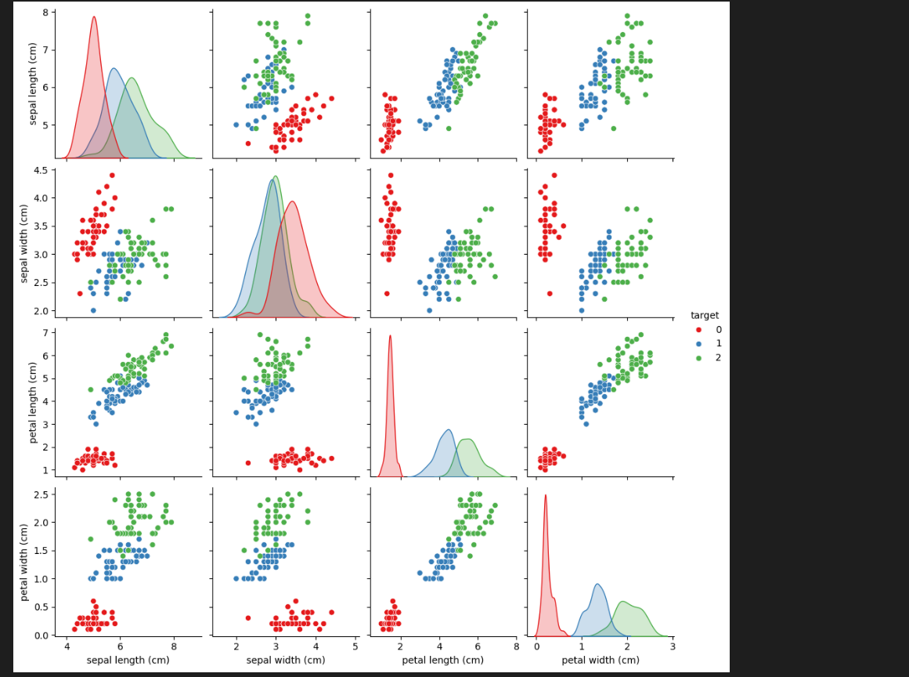
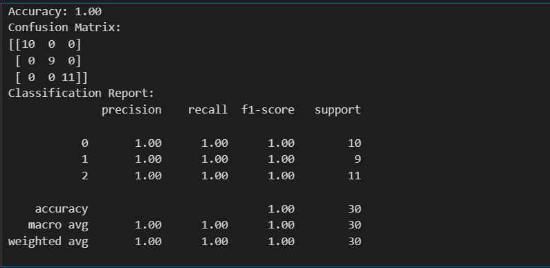
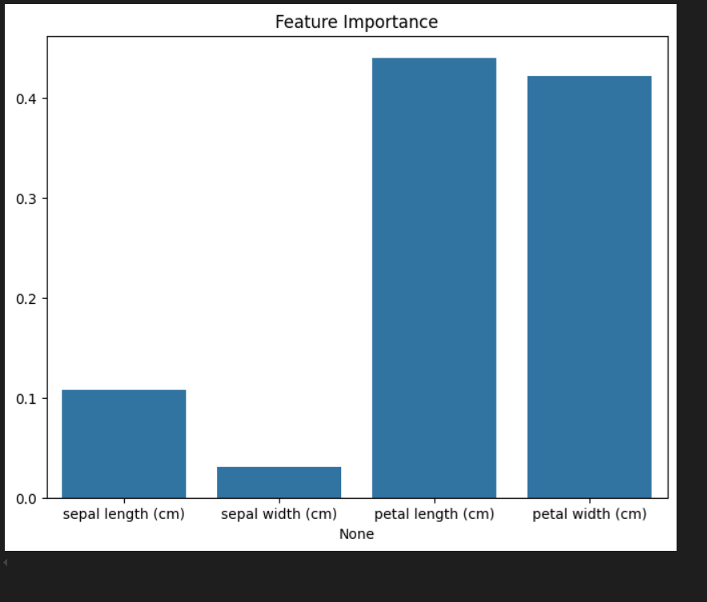

# Machine Learning Model Implementation

## Developer Information

**Name**: Shaik Burujula Jeevanbi

**Company**: CODTECH IT SOLUTIONS  

**ID**: CTO6DL935 

**Domain**: Python Programming 

**Duration**: may 5th,2025 to june 20th,2025 [6 weeks]

**Mentor**:Neela Santhosh

---

## Overview of the Project

This project involves building a predictive machine learning model using `scikit-learn` to classify and predict outcomes from a dataset. The objective is to showcase the implementation and evaluation of a classification model, focusing on model training, testing, and performance evaluation.

### TASK - 1: Predictive Modeling with scikit-learn

### Objective:
To implement a predictive classification model that classifies the iris flowers dataset using a Random Forest Classifier. The goal is to demonstrate the steps of data exploration, preprocessing, model building, evaluation, and interpretation.

### Key Activities:
- Data exploration and visualization
- Data preprocessing (scaling and splitting)
- Model training using Random Forest Classifier
- Model evaluation using various metrics such as accuracy, confusion matrix, and classification report
- Visualization of results, including confusion matrix and feature importance

### Technologies Used:
- **Python Programming Language**
- **Libraries:**
  - `scikit-learn`
  - `pandas`
  - `numpy`
  - `matplotlib`
  - `seaborn`

### Scope:
This project uses the Iris dataset from scikit-learn, which contains 150 samples of iris flowers with four features: sepal length, sepal width, petal length, and petal width. The objective is to build a predictive model that can classify the species of iris flowers based on these features.

### Advantages:
- Demonstrates the process of training and evaluating a classification model.
- Easy-to-understand Iris dataset with clear relationships among features.
- Use of visualization tools to present data insights and model performance.

### Disadvantages:
- The Iris dataset is relatively simple and may not be suitable for real-world complex classification problems.
- Overfitting might occur with more complex models due to the small size of the dataset.

### Key Insights:
- Random Forest model provides high accuracy with relatively simple hyperparameters.
- The most important features in determining the flower species were the petal length and petal width.

### Future Improvements:
- Experiment with more advanced models like Support Vector Machine (SVM), Gradient Boosting, or Neural Networks.
- Tune hyperparameters using techniques like GridSearchCV or RandomizedSearchCV for better performance.
- Implement cross-validation for better model evaluation.

---

## Code Explanation:

The code below demonstrates how to build and evaluate a machine learning model for classifying iris flowers.

1. **Libraries**: Necessary libraries are imported, including `pandas`, `numpy`, and `matplotlib` for data handling and visualization, as well as `scikit-learn` for machine learning tasks.
2. **Dataset**: The Iris dataset is loaded using `scikit-learn`, and it is split into features (`X`) and target labels (`y`).
3. **Data Preprocessing**: The dataset is split into training and testing sets, followed by feature scaling using `StandardScaler` to standardize the features.
4. **Model**: A `RandomForestClassifier` is initialized and trained on the training data.
5. **Evaluation**: The model’s accuracy, confusion matrix, and classification report are computed to evaluate its performance.
6. **Visualization**: The confusion matrix and feature importance are visualized for better understanding of the model's predictions and the importance of each feature.

### Output:
- Accuracy of the model
- Confusion matrix to show how well the model performs across the classes
- Classification report with precision, recall, and F1-score
- Visualization of the confusion matrix and feature importances

#### Example Output:

